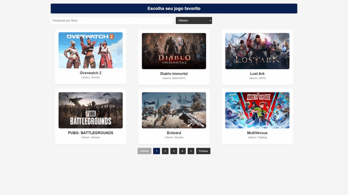

# GameHub: Explorador de Jogos

Este projeto funcional utiliza uma API para exibir os jogos que você mais gosta. Através dessa API, é possível obter uma lista de jogos e explorá-los!


## Projeto em Tempo Real

<a href="https://gamehub-react-sage.vercel.app/">Clique aqui</a> para ver o projeto no ar!


## Pré-requisitos

Antes de começar, certifique-se de ter o seguinte instalado em sua máquina:

- Git: [Download Git](https://git-scm.com/downloads)
- Node.js: [Download Node.js](https://nodejs.org/)

## Instalação

1. Clone o repositório:
https://github.com/fernandohsilva1/game-react.git

2. Entre no diretório do projeto:

3. Instale as dependências:

- Se estiver usando npm:

  ```
  npm install
  ```

- Se estiver usando Yarn:

  ```
  yarn install
  ```

## Executando o Projeto

1. Para iniciar o projeto, execute o seguinte comando:

- Se estiver usando npm:
```
npm start
```

- Se estiver usando Yarn:
```
yarn start
```

- Por fim, iniciará o projeto e poderá ser acessado em [http://localhost:3000](http://localhost:3000)